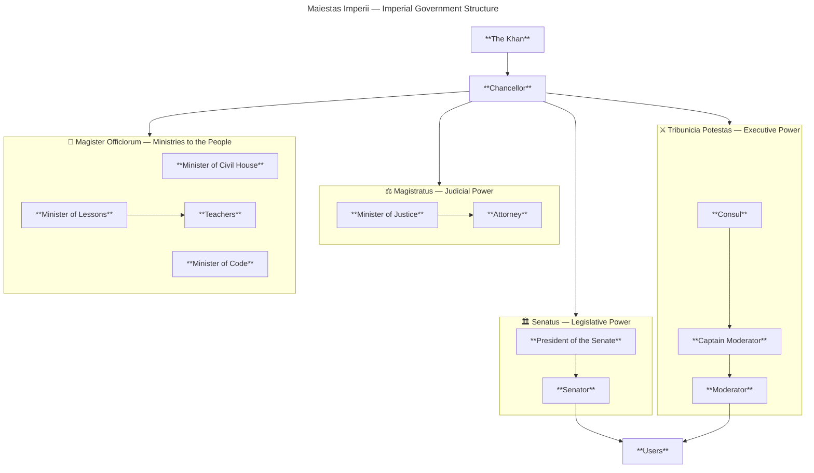

---

## Overview

This document defines the structure of the Language Sloth Community governance system and each institution’s responsibilities.

## Branches (summary)

- **Apex (Imperial Power):** The Khan and the Chancellor
- **Legislative Power:** The Senate
- **Executive Power:** Tribunicia Potestas
- **Judicial Power:** Magistratus
- **Ministries:** Magister Officiorum
- **Users:** The foundation of the entire system

---

## Imperial Power (Maiestas Imperii)

### The Khan

The Khan is the supreme authority and guardian of the system. The Imperial Power supports all branches and is responsible for the overall stability and direction of the community.

The Imperial Power normally does not interfere in daily moderation or administration. Its main role is to work in expansion projects, maintain balance between the branches, and intervene only in extraordinary situations such as:

- Major conflicts
- Institutional crises
- Serious disputes
- Critical community matters

### The Chancellor

The Chancellor supports the administration and bureaucracy of the system.

Responsibilities include:

- Organizing information
- Investigating situations
- Handling reports
- Assisting communication between branches
- Improving speed and accuracy in operations
- Changing the structure of the server internally on Discord

---

## Legislative Power — The Senate

### Purpose

The Senate exists to prevent abuse of power and represent the interests of the users.

The Senate may:

- Audit the staff
- Review executive decisions
- Investigate abuses
- Recommend reforms and updates
- Discuss important community matters
- Vote on disciplinary or structural actions

The Senate is also responsible for listening to the community regarding:

- Suggestions
- Feedback
- Server improvements
- User concerns

### Roles

**President of the Senate**

- Organizes and leads meetings, discussions, debates, votes, and Senate procedures.

**Senators**

- Represent the community and help supervise the integrity of the system.

---

## Executive Power (Tribunicia Potestas)

### The Consul

The Consul is the highest executive authority.

Responsibilities include:

- Training moderators
- Promoting or demoting moderators
- Organizing moderation teams
- Handling complex cases
- Maintaining discipline inside the staff

The Consul also acts as the bridge between the moderation team and the Senate.

### Captain Moderators

Captain Moderators are experienced regional leaders responsible for maintaining order in their teams and assigned world regions.

They:

- Train newer moderators
- Supervise teams
- Maintain discipline
- Recommend promotions or punishments
- Support stability inside the executive branch

### Moderators

Moderators enforce the rules and help users daily.

They:

- Handle reports
- Resolve conflicts
- Assist users
- Enforce server rules
- Maintain a healthy and stable community

They work independently on moderation cases and user support.

---

## Judicial Power — The Magistratus

### Minister of Justice

The Minister of Justice is the highest judicial authority.

Responsibilities include:

- Interpreting rules
- Issuing bans and unbans
- Defining how rules are applied
- Creating precedents through decisions
- Ensuring fairness and consistency

The Minister of Justice is the final interpreter of the community’s legal framework.

### Attorneys

Attorneys are helper users who may defend or speak on behalf of users involved in:

- Reports
- Investigations
- Senate discussions
- Serious disciplinary cases

Their purpose is to ensure fairness and representation.

---

## Ministries (Magister Officiorum)

### Purpose

The Ministries are independent entities that work for the development and improvement of the community.

They support the Imperial Power through projects, education, and specialized services.

### Teachers

Teachers are volunteer users responsible for educational activities and classes inside the community.

They may:

- Organize classes
- Teach subjects
- Guide users
- Help develop community knowledge

---

## Users

Users are the foundation of the entire system. Every institution exists to serve and protect the community.

Users may:

- Report rule violations
- Make suggestions
- Help improve the server
- Support other users
- Participate in community growth

The purpose of the system is to ensure that users feel:

- Safe
- Connected
- Heard
- Respected
- Happy within the community